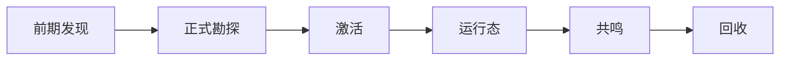

# 模组实现目录 {#modding-implementation-catalogue}

这个条目整理 Forge 侧遗址系统的实现契约，把已验证的 API、建议实现的对象和尚未落地的类分开写。

## 已验证的运行时事实 {#verified-runtime-facts}

| 问题 | 已验证的 API 或事件 | 结论 |
| --- | --- | --- |
| 原版刷扫链路 | `BrushItem.useOn(...)`、`BrushItem.onUseTick(...)`、`BrushableBlockEntity.brush(...)` | 前期发现可直接复用原版考古刷扫流程 |
| 世界级持久化 | `ServerLevel.getDataStorage()`、`DimensionDataStorage.computeIfAbsent(...)` | 存档持久化数据应使用 `SavedData` |
| 持久化写盘 | `SavedData.setDirty()`、`LevelEvent.Save` | 修改持久化数据后必须标脏，写盘在 world save 时完成 |
| 区块 NBT | `ChunkDataEvent.Load` / `Save` | 适合辅助数据，不适合遗址记录主表 |
| 区块生命周期 | `ChunkEvent.Load` / `Unload` | 可做缓存和资源释放，不能替代存档持久化数据 |
| 区块可见性 | `ChunkWatchEvent.Watch` / `UnWatch` | 适合按玩家同步区块局部数据 |
| 方块提取交互 | `Block#use(BlockState, Level, BlockPos, Player, InteractionHand, BlockHitResult)` | 揭露态与提取态可以分离 |
| 玩家交互 | `PlayerInteractEvent.RightClickItem` / `RightClickBlock` | 适合做正式勘探提交面和激活适配器 |
| 玩家知识迁移 | `PlayerEvent.Clone` | 长期知识如挂在玩家上，重生时必须复制 |
| 客户端 tooltip | `ItemTooltipEvent` | 玩家对象可能为 `null` |

## 数据所有权总表 {#data-ownership-summary}

| 数据 | 建议放在哪里 | 不该放在哪里 |
| --- | --- | --- |
| 前期发现节点是否已耗尽 | 世界方块状态 | 存档持久化数据 |
| 遗址实例是否存在 | `SiteLedgerSavedData` | 玩家短标记 |
| 遗址当前是否运行中 | `SiteRuntimeRegistry` | 区块缓存 |
| 区块局部表现或辅助信息 | chunk data 或 chunk capability | 存档持久化数据 |
| 玩家待提交遗址 | `player.getPersistentData()` | 存档持久化数据 |
| 遗物结果 | 物品快照或独立记录 | live runtime |

## 写入时机总表 {#write-timing-matrix}

数据写到哪里固然重要，什么时候写同样关键。

| 数据 | 首次写入时机 | 后续读取方 |
| --- | --- | --- |
| `DiscoveredSiteRecord` | 正式勘探确认后 | 激活、运行态、回收 |
| `lc_pending_site_ref` 这类玩家短标记 | 正式勘探结束、激活之前 | 激活层 |
| `ActiveSiteRuntime` | 激活服务通过后 | 运行态服务、结算服务 |
| 区块辅助缓存 | chunk load、watch 或局部计算完成后 | 客户端同步、局部表现 |
| `ResonanceResult` | 激活或现场启动阶段 | runtime、recovery |
| `RecoveredRelicSnapshot` | 回收结算时 | tooltip、图鉴、后续处理 |
| 玩家长期知识 | 回收、鉴定或长期推进节点 | tooltip、后续勘探门槛 |

写入时机错了，对象就算放对地方也会出现重复初始化、过期状态或错误回写。

## 建议实现的第一批对象 {#first-batch-of-recommended-objects}

| 对象 | 作用 | 当前状态 |
| --- | --- | --- |
| `CivilizationShellDefinition` | 定义前期发现的文明外壳 | 待实现 |
| `EarlyExcavationNodeDefinition` | 定义一种前期考古节点 | 待实现 |
| `SiteTypeDefinition` | 定义一种遗址类型 | 待实现 |
| `SiteTypeRegistry` | 注册遗址类型 | 待实现 |
| `SiteRef` | 引用一座具体遗址 | 待实现 |
| `DiscoveredSiteRecord` | 存档持久化数据中的一条实例记录 | 待实现 |
| `SiteLedgerSavedData` | 维度级存档持久化数据 | 待实现 |
| `ActivationContext` | 一次激活提交的输入对象 | 待实现 |
| `ActivationResult` | 激活结果 | 待实现 |
| `ActivationService` | 激活服务 | 待实现 |
| `ActivationAdapter` | 把不同交互入口转成同一份上下文 | 待实现 |
| `SiteRuntimeBridge` | 在服务通过后打开运行态 | 待实现 |
| `SiteRuntimeRegistry` | 管理活跃运行态 | 待实现 |
| `ActiveSiteRuntime` | 现场状态核心 | 待实现 |
| `RecoveredRelicSnapshot` | 回收快照 | 待实现 |
| `RelicTooltipView` | 格式化已保存结果 | 待实现 |

## 最短可玩流程 {#minimum-call-chain}

先按下面五步做就够了：

1. 前期发现或正式勘探入口确认一座合法遗址。
2. 正式勘探把结果写入 `SiteLedgerSavedData`，并生成 `SiteRef`。
3. 激活层通过 `ActivationAdapter -> ActivationService` 把 `SiteRef` 接入 `SiteRuntimeRegistry`。
4. 运行态读取 `ResonanceResult` 并推进 `ActiveSiteRuntime`。
5. 回收层把结果折叠成 `RecoveredRelicSnapshot`，之后只允许视图层读取快照。

这五步的作用，是把“正式记录”“运行态”“回收结果”三种状态拆开。少走一步，后面就会丢掉稳定引用。

## 遗址记录主表、区块缓存、玩家短标记 {#world-truth-chunk-cache-player-markers}

| 层 | 具体建议 | 生命周期 |
| --- | --- | --- |
| 遗址记录主表 | `SiteLedgerSavedData` | 跟随维度存档 |
| 区块缓存 | `ChunkDataEvent` 或 `AttachCapabilitiesEvent<LevelChunk>` | 跟随区块 load / unload |
| 玩家短标记 | `lc_pending_site_ref` | 只跨正式勘探和激活两个阶段 |

## 物品快照与玩家知识的分离 {#item-snapshot-vs-player-knowledge}

回收阶段至少要分开两条写入：

| 数据 | 推荐落点 | 原因 |
| --- | --- | --- |
| `RecoveredRelicSnapshot` | `ItemStack` 自身的 NBT | 物品流转时结果必须跟着物品走 |
| `lc_identification_level` 这类长期知识 | 玩家长期数据 | 这是玩家理解能力，不是物品本体 |

玩家知识跟着角色走，遗物快照跟着物品走，生命周期不同，不能合并。

## 第一批验证 {#first-batch-proofs}

1. 前期发现能产出线索，并把节点稳定耗尽成不可再考古状态。
2. 正式勘探能把交互落成 `SiteRef`。
3. 激活能从 `SiteRef` 打开且只打开一个 runtime。
4. 运行态能在 `LevelEvent.Save` 前后保持持久化数据一致。
5. `ChunkEvent.Unload` 不会误删存档持久化数据。
6. tooltip 能从保存结果独立渲染。
7. 遗物结果跟随 `ItemStack` 流转，而不是只存在于玩家数据里。
