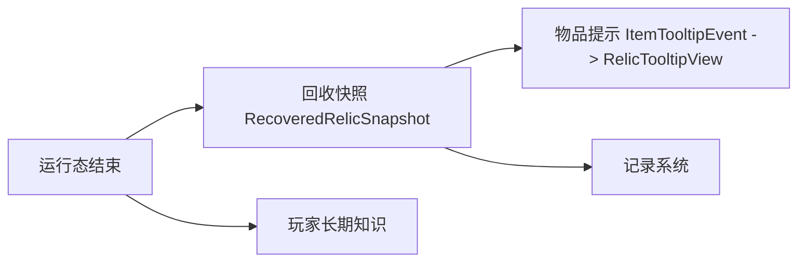

# 回收实现 {#recovery-implementation}

回收实现把运行态结果折叠成长期可读的数据。这里必须分开三件事：玩家长期知识、遗物快照、客户端 tooltip。



## 已验证的关键边界 {#verified-key-boundaries}

| 主题 | 已验证的 API 或事件 | 结论 |
| --- | --- | --- |
| 玩家重生迁移 | `PlayerEvent.Clone.getOriginal()`、`PlayerEvent.Clone.isWasDeath()` | 如果知识值挂在玩家实体数据上，重生时必须复制 |
| tooltip 读取 | `ItemTooltipEvent.getItemStack()`、`getToolTip()`、`getFlags()` | tooltip 只应读取已保存结果 |
| tooltip 空玩家 | `ItemTooltipEvent.getEntity()` 可为 `null` | 渲染不能依赖 live player |
| 物品 NBT 读取 | `ItemStack.getTag()`、`getOrCreateTag()` | 快照可直接挂在物品 NBT 上 |
| 物品 NBT 写回 | `ItemStack.setTag(@Nullable CompoundTag)` | 必要时可整体替换 tag |
| 玩家初始化 | `PlayerEvent.PlayerLoggedInEvent` | 缺失键可在登录时补齐 |

## 数据分层 {#data-layering}

| 数据 | 推荐位置 |
| --- | --- |
| `lc_identification_level` | 玩家长期数据 |
| `siteRef`、`siteTypeId`、`ResonanceState`、`patternKey` | 遗物快照 |
| 图鉴或统计结果 | 独立记录层 |

## 物品快照写入边界 {#item-snapshot-write-boundary}

遗物快照建议放在 `ItemStack` 的单一根 tag 下，而不是把字段散到顶层。

```java
public static final String RELIC_RESULT_KEY = "lost_civilization.recovered_relic";
```

对应写入流程应固定为：

1. 读取 `stack.getOrCreateTag()`。
2. 在单一根 key 下写入 `RecoveredRelicSnapshot` 对应字段。
3. 不覆盖与遗物结果无关的其他物品 tag。

这样做的原因是避免和附魔、显示名、模组附加字段互相踩写。

## `RecoveredRelicSnapshot` 建议结构 {#recovered-relic-snapshot-structure}

```java
public record RecoveredRelicSnapshot(
        String siteRef,
        String siteTypeId,
        ResonanceState state,
        String patternKey
) {}
```

## 建议的快照编解码 {#snapshot-codec-shape}

```java
public final class RecoveredRelicSnapshotCodec {
    private RecoveredRelicSnapshotCodec() {
    }

    public static void write(ItemStack stack, RecoveredRelicSnapshot snapshot) {
        CompoundTag root = stack.getOrCreateTag();
        CompoundTag resultTag = new CompoundTag();
        resultTag.putString("site_ref", snapshot.siteRef());
        resultTag.putString("site_type_id", snapshot.siteTypeId());
        resultTag.putString("state", snapshot.state().name());
        resultTag.putString("pattern_key", snapshot.patternKey());
        root.put(RELIC_RESULT_KEY, resultTag);
    }
}
```

这里的关键不是字段名本身，而是编码入口必须只有一处。否则 tooltip、回收和调试命令很快就会各写一份格式。

## 玩家长期知识迁移 {#player-long-term-knowledge-migration}

如果 `lc_identification_level` 挂在玩家实体数据上，至少要有下面这条订阅：

```java
@SubscribeEvent
public static void onPlayerClone(PlayerEvent.Clone event) {
    if (!event.isWasDeath()) {
        return;
    }

    // 从 event.getOriginal() 复制长期知识到新玩家
}
```

这里只复制长期知识，不复制待处理短标记和 live runtime。

## tooltip 读取规则 {#tooltip-read-rules}

`ItemTooltipEvent` 不负责推导结果，只负责展示结果。

```java
@SubscribeEvent
public static void onTooltip(ItemTooltipEvent event) {
    // 1. 从 event.getItemStack() 的 NBT 读取 RecoveredRelicSnapshot
    // 2. 读取玩家长期知识；event.getEntity() 可能为 null
    // 3. 调用 RelicTooltipView.build(...)
    // 4. 把文本追加到 event.getToolTip()
}
```

推荐的读取原则如下：

1. 先尝试 `event.getItemStack().getTag()`。
2. tag 不存在时直接走最低限度显示，不抛异常。
3. `event.getEntity()` 为空时，跳过玩家长期知识增强。

## `RelicTooltipView` 的职责 {#relic-tooltip-view-responsibilities}

| 该做什么 | 不该做什么 |
| --- | --- |
| 根据快照和知识值格式化文本 | 重算共鸣 |
| 在空玩家路径下优雅降级 | 访问运行态 registry |
| 输出稳定文本行 | 查询世界账本决定结果 |

## 最低测试要求 {#minimum-test-requirements}

| 场景 | 期望 |
| --- | --- |
| `player == null` 的 tooltip 构建 | 仍能显示最低限度信息 |
| 物品没有结果 tag | 安静降级，不报错 |
| 低知识值 | 只显示粗粒度结果 |
| 高知识值 | 显示更深的状态或模式信息 |
| 死亡重生后 | 长期知识保留，短标记不保留 |

## 实现红线 {#implementation-red-lines}

1. 不把运行态对象直接序列化成遗物结果。
2. 不把所有回收数据都塞进玩家实体。
3. 不让 tooltip 充当系统唯一事实来源。
4. 不在多个位置各自定义不同的物品快照格式。
