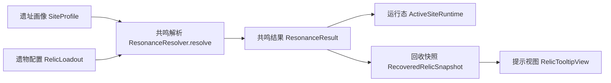

# 共鸣实现 {#resonance-implementation}

共鸣只做一件事：把遗址输入和玩家输入折叠成 `ResonanceResult`。它不持有现场生命周期，也不直接生成 tooltip。



## 已验证的 Forge 边界 {#verified-forge-boundaries}

下列 API 已经核对过，可直接作为实现边界：

| 主题 | 已验证 API | 结论 |
| --- | --- | --- |
| tooltip 构造 | `ItemTooltipEvent(@NotNull ItemStack, @Nullable Player, List<Component>, TooltipFlag)` | tooltip 事件允许 `player == null` |
| tooltip 读取 | `ItemTooltipEvent.getItemStack()`、`getToolTip()`、`getFlags()` | tooltip 可以直接读取已保存快照并追加文本 |
| tooltip 空玩家 | `ItemTooltipEvent.getEntity()` | 启动阶段和部分客户端路径不能依赖玩家对象 |

这意味着共鸣结果必须先进入快照，再由 tooltip 读取——tooltip 不能回查 live runtime。

## 当前类型 {#type-contract}

```java
public record SiteProfile(
        String id,
        SitePressure pressure,
        int baseStability,
        float guardianMultiplier
) {}

public record RelicLoadout(
        RelicTendency tendency,
        BuildPosture posture,
        CivilizationLean lean,
        int identificationLevel
) {}

public record ResonanceResult(
        ResonanceState state,
        String patternKey
) {}
```

`SiteProfile` 和 `RelicLoadout` 负责整理输入，`ResonanceResult` 负责给出简短结果。这样以后加字段时，resolver 的签名也不会一路膨胀。

## 文件分工 {#file-boundaries}

| 文件 | 最小职责 |
| --- | --- |
| `SitePressure` | 遗址压力枚举 |
| `RelicTendency`、`BuildPosture`、`CivilizationLean` | 玩家输入枚举 |
| `ResonanceState` | 共鸣结果状态枚举 |
| `SiteProfile` | 遗址输入对象 |
| `RelicLoadout` | 玩家输入对象 |
| `ResonanceResult` | 简短结果 |
| `ResonanceResolver` | 唯一判定入口 |

## 纯判定约束 {#pure-evaluation-constraints}

`ResonanceResolver.resolve(site, loadout)` 应保持纯函数。

```java
public final class ResonanceResolver {
    private ResonanceResolver() {
    }

    public static ResonanceResult resolve(SiteProfile site, RelicLoadout loadout) {
        if (site.pressure() == SitePressure.CONTAMINATION
                && loadout.tendency() == RelicTendency.FILTER) {
            return new ResonanceResult(ResonanceState.TUNED, "contamination.cleanse");
        }

        if (site.pressure() == SitePressure.CONTAMINATION
                && loadout.tendency() == RelicTendency.SUNDER
                && loadout.posture() == BuildPosture.BREACH) {
            return new ResonanceResult(ResonanceState.OVERLOADED, "contamination.burst");
        }

        return new ResonanceResult(ResonanceState.DORMANT, "generic.idle");
    }
}
```

保持纯函数带来三个直接好处：

1. 单元测试可以直接覆盖。
2. runtime、recovery 和 tooltip 读到的是同一份结果。
3. 客户端不需要补一套私有推导逻辑。

## 下游消费顺序 {#downstream-consumption-order}

消费顺序固定如下：

1. 激活或现场启动阶段计算 `ResonanceResult`。
2. `ActiveSiteRuntime` 读取结果并执行现场后果。
3. 回收阶段把 `state` 和 `patternKey` 写入 `RecoveredRelicSnapshot`。
4. `RelicTooltipView` 只读取快照与可选长期知识值。

这条顺序里，只有 runtime 和 recovery 可以解释结果；tooltip 只格式化结果。

## 最小测试集 {#minimum-test-matrix}

| Site profile | Loadout | 期望结果 |
| --- | --- | --- |
| `CONTAMINATION` | `FILTER + STABILIZE + MECHANICAL + 0` | `TUNED` + `contamination.cleanse` |
| `CONTAMINATION` | `SUNDER + BREACH + ARCANE + 1` | `OVERLOADED` + `contamination.burst` |
| fallback | 任意不支持组合 | `DORMANT` + `generic.idle` |
| tooltip with `player == null` | 已保存快照 | 仍能输出最低限度文本 |

## 实现红线 {#implementation-red-lines}

1. 不把 runtime 对象直接序列化进遗物。
2. 不让 tooltip 临时重算共鸣。
3. 不让 resolver 直接访问玩家、世界或现场注册表。
4. 不把 `patternKey` 写成只在某个 UI 页面里才有意义的临时字符串。
