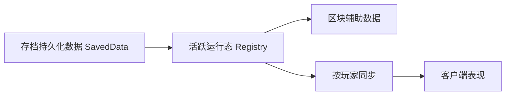

# 现场运行态实现 {#site-runtime-implementation}

现场运行态的难点不在于“要不要 tick”，而在于“每类数据该住在哪一层”。整体分三层持久化加一层活状态。



## 已验证的持久化与生命周期 API {#verified-persistence-and-lifecycle-api}

| 主题 | 已验证的 API 或事件 | 实现结论 |
| --- | --- | --- |
| 存档持久化数据入口 | `ServerLevel.getDataStorage()` | 持久化数据挂在 `ServerLevel` |
| 持久化数据创建或读取 | `DimensionDataStorage.computeIfAbsent(Function<CompoundTag, T>, Supplier<T>, String)` | 适合加载 `SiteLedgerSavedData` |
| 标脏 | `SavedData.setDirty()` | 持久化数据改动后必须调用 |
| 保存检查点 | `LevelEvent.Save` | 服务端保存时可做持久化数据一致性检查 |
| 区块 NBT | `ChunkDataEvent.Load` / `Save` | 只放区块辅助数据 |
| 区块 load | `ChunkEvent.Load` | 不做重世界交互 |
| 区块 unload | `ChunkEvent.Unload` | 释放局部缓存 |
| 区块 capability | `AttachCapabilitiesEvent<T>`、`IForgeLevelChunk extends ICapabilityProvider` | 可作为区块局部状态的另一条实现路线 |
| 玩家 watching | `ChunkWatchEvent.Watch` / `UnWatch` | 按玩家发送附加区块数据 |

## 四层实现分工 {#four-layer-implementation-split}

| 层 | 推荐实现 | 保存什么 |
| --- | --- | --- |
| 遗址记录主表 | `SiteLedgerSavedData` | 遗址实例、锚点、生命周期、覆盖区块 |
| 现场状态 | `SiteRuntimeRegistry` + `ActiveSiteRuntime` | 当前压力、阶段、临时事件、owner |
| 区块辅助层 | `ChunkDataEvent` 或 chunk capability | 局部表现、缓存、轻量索引 |
| 同步层 | `ChunkWatchEvent.Watch` / `UnWatch` | 发给客户端的区块附加载荷 |

## `SiteLedgerSavedData` 示例结构 {#site-ledger-saved-data-skeleton}

```java
public final class SiteLedgerSavedData extends SavedData {
    private final Map<String, DiscoveredSiteRecord> records = new HashMap<>();

    public static SiteLedgerSavedData load(CompoundTag tag) {
        SiteLedgerSavedData data = new SiteLedgerSavedData();
        // 解析 records
        return data;
    }

    @Override
    public CompoundTag save(CompoundTag tag) {
        // 写回 records
        return tag;
    }

    public DiscoveredSiteRecord put(DiscoveredSiteRecord record) {
        records.put(record.ref().toString(), record);
        setDirty();
        return record;
    }
}
```

这个示例的重点不在字段细节，而在于三条约束：

- 存档持久化数据用 `SavedData`；
- 修改后立即 `setDirty()`；
- 真正写盘由世界保存流程触发，不由代码主动触发。

## `LevelEvent.Save` 的职责 {#level-event-save-responsibilities}

`LevelEvent.Save` 只在服务端触发，适合做：

- 持久化数据一致性断言；
- 运行态到持久化数据的收束检查；
- 需要在保存边界前刷新的统计值。

逐 tick 的主逻辑不该放在这里。

## 区块辅助数据的两条路线 {#two-paths-for-chunk-side-data}

### 路线 A：`ChunkDataEvent.Load` / `ChunkDataEvent.Save` {#route-a-chunk-data-event-load-save}

适合保存：

- 某个 chunk 当前暴露出的遗址局部标记；
- 已计算好的可见性或表现缓存；
- 与 `coveredChunkKeys` 对应的轻量派生值。

注意事项：

1. `ChunkDataEvent.Load` 在 `ChunkSerializer.read(...)` 期间触发，已验证为异步。
2. 因此不要在这里访问重世界逻辑，不要启动运行态，也不要跨 chunk 查询。

### 路线 B：`AttachCapabilitiesEvent<LevelChunk>` {#route-b-attach-capabilities-level-chunk}

适合保存：

- 生命周期跟随 `LevelChunk` 的局部状态对象；
- 需要在 chunk 无效化时统一释放的缓存。

这条路线更适合复杂局部状态，但同样不是存档持久化数据的替代。

## `ChunkEvent.Load` 与 `ChunkEvent.Unload` {#chunk-event-load-and-unload}

| 事件 | 合理用途 | 不该做什么 |
| --- | --- | --- |
| `ChunkEvent.Load` | 回填轻量缓存、准备局部同步 | 创建 runtime、做重交互、跨区块查询 |
| `ChunkEvent.Unload` | 释放局部缓存、断开弱引用 | 删除存档持久化数据记录 |

`ChunkEvent.Load` 已验证可能早于 `LevelChunk` 达到 `ChunkStatus.FULL`，所以它不是现场逻辑入口。

## 覆盖区块算法建议 {#coverage-chunk-algorithm-recommendation}

每条 `DiscoveredSiteRecord` 在存档持久化数据中保存 `coveredChunkKeys`，初始化建议按下面做：

1. 以遗址锚点为中心。
2. 用事件半径换算出 chunk 半径。
3. 预计算覆盖区块集合。
4. chunk 事件和 watch 事件都只围绕这组键工作。

这样可以稳定处理：

- 进入可见范围时的同步；
- 区块卸载时的局部缓存释放；
- 一座大遗址跨多个 chunk 的局部状态追踪。

## `ChunkWatchEvent.Watch` / `UnWatch` {#chunk-watch-event-watch-unwatch}

这组事件最适合做“玩家开始看见这个 chunk 时，补发附加遗址数据”。它解决的是同步问题，不是持久化。

| 事件 | 推荐用途 |
| --- | --- |
| `ChunkWatchEvent.Watch` | 向该玩家同步 chunk 内的遗址局部状态或覆盖标记 |
| `ChunkWatchEvent.UnWatch` | 回收该玩家的相关客户端缓存或订阅状态 |

## 当前对象分工 {#current-recommended-object-boundaries}

| 对象 | 职责 |
| --- | --- |
| `SiteLedgerSavedData` | 遗址记录主表 |
| `SiteRuntimeRegistry` | 当前运行中的现场 |
| `ActiveSiteRuntime` | 单座遗址的动态状态 |
| `ChunkSiteAuxData` | 某个 chunk 的辅助缓存 |
| `SiteSyncPayload` | 发给客户端的最小附加数据 |

## 必须避免的实现错误 {#implementation-errors-to-avoid}

1. 把 `ChunkDataEvent.Load` 当成安全的主线程入口。
2. 把 `ChunkEvent.Unload` 当成删除遗址实例的依据。
3. 改了 `SavedData` 却不调用 `setDirty()`。
