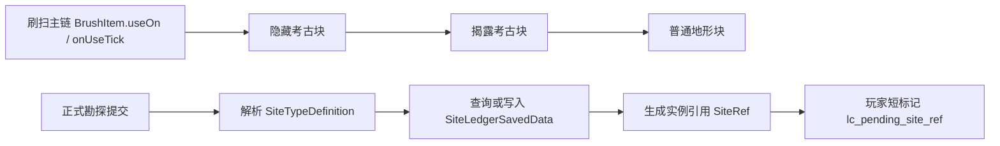

# 勘探实现 {#survey-implementation}

勘探实现现在分成两个实现面：

- 前期发现实现：让环境考古点真的能被刷扫、揭露、提取并耗尽。
- 正式勘探实现：把有效提交落成 `SiteRef`，写进世界账本，再交给激活阶段。



## 已验证的能力 {#verified-capabilities}

| 能力 | 已验证的方法 | 用途 |
| --- | --- | --- |
| 刷扫启动 | `BrushItem.useOn(UseOnContext)` | 启动持续刷扫 |
| 刷扫推进 | `BrushItem.onUseTick(Level, LivingEntity, ItemStack, int)` | 周期性推进刷扫进度 |
| 刷扫进度与完成 | `BrushableBlockEntity.brush(long, Player, Direction)` | 累计进度并在完成时结算 |
| 刷扫后的状态切换 | `BrushableBlock.getTurnsInto()` | 从隐藏态切到揭露态 |
| 揭露后的提取交互 | `Block#use(BlockState, Level, BlockPos, Player, InteractionHand, BlockHitResult)` | 提取后把节点耗尽 |
| 世界账本入口 | `ServerLevel.getDataStorage()`、`DimensionDataStorage.computeIfAbsent(...)` | 正式勘探的权威持久化入口 |
| 正式提交交互面 | `PlayerInteractEvent.RightClickItem`、`PlayerInteractEvent.RightClickBlock` | 收集正式勘探上下文 |

## 前期发现实现 {#early-discovery-implementation}

前期发现的主干不再是 `RightClickItem` 或 `RightClickBlock`。它的主干是原版刷扫链路。

### 推荐类形态 {#recommended-class-shape}

```java
public final class EarlyExcavationBrushBlock extends BrushableBlock {
    // 刷扫完成后转成 RevealedExcavationBlock
}

public final class RevealedExcavationBlock extends Block {
    @Override
    public InteractionResult use(
            BlockState state,
            Level level,
            BlockPos pos,
            Player player,
            InteractionHand hand,
            BlockHitResult hitResult
    ) {
        // 1. 发放提取产物
        // 2. 写入前期发现进度或知识位
        // 3. 替换成 exhaustedState
        return InteractionResult.sidedSuccess(level.isClientSide);
    }
}
```

如果某个高信号节点需要额外渲染，可单独补一支显式节点：

```java
public final class SignalExcavationNodeBlock extends BaseEntityBlock {}
public final class SignalExcavationNodeBlockEntity extends BlockEntity {}
```

但这一支只用于少量显式节点，不替代主力环境载体。

### 推荐状态机 {#recommended-state-machine}

1. 世界生成放入 `EarlyExcavationBrushBlock`。
2. 玩家持续刷扫，`BrushableBlockEntity.brush(...)` 推进进度。
3. 刷扫完成后，节点通过 `getTurnsInto()` 变成 `RevealedExcavationBlock`。
4. 玩家对揭露态执行提取交互。
5. 节点替换为普通地形块，彻底失去考古资格。

## 正式勘探实现 {#formal-survey-implementation}

正式勘探才负责遗址实例、世界账本和待激活引用。

### 最小数据结构 {#minimum-data-structure}

```java
public record SiteRef(
        String siteTypeId,
        long primaryChunkKey,
        int serial
) {}

public record DiscoveredSiteRecord(
        SiteRef ref,
        BlockPos anchor,
        String siteTypeId,
        Set<Long> coveredChunkKeys,
        SiteLifecycle lifecycle
) {}
```

### 世界账本入口 {#world-ledger-entry}

```java
SiteLedgerSavedData ledger = level.getDataStorage().computeIfAbsent(
        SiteLedgerSavedData::load,
        SiteLedgerSavedData::new,
        "lost_civilization_site_ledger"
);
```

只有在新增记录或修改生命周期后，才调用 `setDirty()`。

### 推荐的正式勘探流程 {#recommended-formal-survey-flow}

1. 由 `RightClickItem` 或 `RightClickBlock` 收集正式勘探提交上下文。
2. 解析候选 `SiteTypeDefinition`。
3. 用锚点和类型在 `SiteLedgerSavedData` 中查找已有记录。
4. 如果不存在，则创建新的 `DiscoveredSiteRecord`。
5. 把 `SiteRef` 的字符串形式写入 `lc_pending_site_ref`。

### 结构、群系和实例的关系 {#structures-biomes-and-instances}

| 层 | 在实现中的位置 |
| --- | --- |
| 宿主结构或作者标记 | 决定是否命中正式遗址候选 |
| 群系修正 | 只调整参数，不决定实例主键 |
| 遗址实例引用 | 由账本统一生成和保存 |

## 玩家数据边界 {#player-data-boundary}

| 数据 | 推荐位置 | 说明 |
| --- | --- | --- |
| 前期发现进度或知识位 | 玩家长期数据 | 可以被前期发现和回收消费，但不保存正式遗址状态 |
| `lc_pending_site_ref` | `player.getPersistentData()` | 只跨正式勘探和激活两个阶段 |

前期发现不写：

- `SiteRef`
- `DiscoveredSiteRecord`
- `SiteLedgerSavedData`

## 实现红线 {#implementation-red-lines}

1. 不让前期发现依赖世界账本。
2. 不让前期发现依赖“放置时打标记”。
3. 不让 `RightClickItem` / `RightClickBlock` 取代前期发现的刷扫主干。
4. 不让正式勘探把整份 `DiscoveredSiteRecord` 塞回玩家数据。
5. 不让可自动化批量制造的对象成为前期考古目标。
